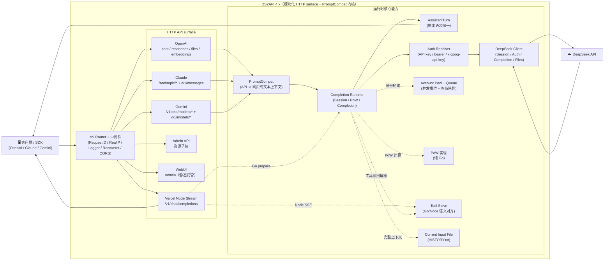

<p align="center">
  
</p>

# DS2API

## 注：本项目由原作者版本([CJackHwang/ds2api](https://github.com/CJackHwang/ds2api)) 二次开发而来。原仓库现已归档

### [重要]本项目将在8月15号21点转为私密仓库，详细请阅读[#21](https://github.com/ouqiting/ds2api/issues/21)


<a href="https://trendshift.io/repositories/24508" target="_blank"></a>

[](LICENSE)


[](docs/DEPLOY.md)

[](https://zeabur.com/templates/L4CFHP)
[](https://vercel.com/new/clone?repository-url=https://github.com/ouqiting/ds2api)

将 DeepSeek Web 对话能力转换为 OpenAI、Claude 与 Gemini 兼容 API。核心后端以 **Go** 实现，Vercel 流式桥接额外使用少量 Node Runtime，前端为 React WebUI 管理台（源码在 `webui/`，部署时自动构建到 `static/admin`）。

文档入口：[文档导航](docs/README.md) / [架构说明](docs/ARCHITECTURE.md) / [接口文档](API.md)

【感谢Linux.do社区及GitHub社区各位开发者对项目的支持与贡献】

> **重要免责声明**
> 
> 本仓库仅供学习、研究、个人实验和内部验证使用，不提供任何形式的商业授权、适用性保证或结果保证。
> 
> 作者及仓库维护者不对因使用、修改、分发、部署或依赖本项目而产生的任何直接或间接损失、账号封禁、数据丢失、法律风险或第三方索赔负责。
> 
> 请勿将本项目用于违反服务条款、协议、法律法规或平台规则的场景。商业使用前请自行确认 `LICENSE`、相关协议以及你是否获得了作者的书面许可。

## 目录

- [架构概览（摘要）](#架构概览摘要)
- [核心能力](#核心能力)
- [平台兼容矩阵](#平台兼容矩阵)
- [模型支持](#模型支持)
  - [OpenAI 接口](#openai-接口get-v1models)
  - [Claude 接口](#claude-接口get-anthropicv1models)
  - [Gemini 接口](#gemini-接口)
- [快速开始](#快速开始)
  - [方式一：下载 Release 构建包](#方式一下载-release-构建包)
  - [方式二：Docker 运行](#方式二docker-运行)
  - [方式三：Vercel 部署](#方式三vercel-部署)
  - [方式四：本地源码运行](#方式四本地源码运行)
- [配置说明](#配置说明)
- [鉴权模式](#鉴权模式)
- [并发模型](#并发模型)
- [Mihomo 代理桥（一号一 IP）](#mihomo-代理桥一号一-ip)
- [Tool Call 适配](#tool-call-适配)
- [本地开发抓包工具](#本地开发抓包工具)
- [文档索引](#文档索引)
- [测试](#测试)
- [Release 自动构建（GitHub Actions）](#release-自动构建github-actions)
- [免责声明](#免责声明)

## 架构概览（摘要）



详细架构拆分与目录职责见 [docs/ARCHITECTURE.md](docs/ARCHITECTURE.md)。

- **后端**：Go（`cmd/ds2api/`、`api/`、`internal/`），不依赖 Python 运行时
- **前端**：React 管理台（`webui/`），运行时托管静态构建产物
- **部署**：本地运行、Docker、Vercel Serverless、Linux systemd

## 核心能力

| 能力 | 说明 |
| --- | --- |
| OpenAI 兼容 | `GET /v1/models`、`GET /v1/models/{id}`、`POST /v1/chat/completions`、`POST /v1/responses`、`GET /v1/responses/{response_id}`、`POST /v1/embeddings`、`POST /v1/files`、`GET /v1/files/{file_id}` |
| Claude 兼容 | `GET /anthropic/v1/models`、`POST /anthropic/v1/messages`、`POST /anthropic/v1/messages/count_tokens`（及快捷路径 `/v1/messages`、`/messages`） |
| Gemini 兼容 | `POST /v1beta/models/{model}:generateContent`、`POST /v1beta/models/{model}:streamGenerateContent`（及 `/v1/models/{model}:*` 路径） |
| Ollama 兼容 | `GET /api/version`、`GET /api/tags`、`POST /api/show` |
| 统一 CORS 兼容 | `/v1/*`、`/anthropic/*`、`/v1beta/models/*`、`/api/*`、`/admin/*` 统一走同一套 CORS 策略；Vercel 上 `/v1/chat/completions` 的 Node Runtime 也对齐相同放行规则，尽量减少第三方预检请求头限制 |
| 多账号轮询 | 自动 token 刷新、邮箱/手机号双登录方式 |
| Mihomo 代理桥（一号一 IP） | 机场订阅转本地独立 SOCKS5 端口，账号绑定独占节点出口，实现“一个账号一个 IP”防连坐；含自动测速、故障转移、一键分配（详见 [MIHOMO_BRIDGE.md](docs/MIHOMO_BRIDGE.md)） |
| 并发队列控制 | 每账号 in-flight 上限 + 等待队列，动态计算建议并发值 |
| DeepSeek PoW | 纯 Go 高性能实现（DeepSeekHashV1），毫秒级响应 |
| Tool Calling | 防泄漏处理：非代码块高置信特征识别、`delta.tool_calls` 早发、结构化增量输出 |
| Admin API | 配置管理、运行时设置热更新、代理管理、账号测试 / 批量测试、会话清理、导入导出、Vercel 同步、版本检查 |
| WebUI 管理台 | `/admin` 单页应用（中英文双语、深色模式，支持查看服务器端对话记录） |
| 运维探针 | `GET /healthz`（存活）、`GET /readyz`（就绪） |

OpenAI `/v1/*` 仍是推荐的规范路径；同时支持 `/models`、`/chat/completions`、`/responses`、`/embeddings`、`/files`、`/files/{file_id}` 等根路径快捷路由，方便只配置 DS2API 根地址的第三方客户端。

## 平台兼容矩阵

| 级别 | 平台 | 当前状态 |
| --- | --- | --- |
| P0 | Codex CLI/SDK（`wire_api=chat` / `wire_api=responses`） | ✅ |
| P0 | OpenAI SDK（JS/Python，chat + responses） | ✅ |
| P0 | Vercel AI SDK（openai-compatible） | ✅ |
| P0 | Anthropic SDK（messages） | ✅ |
| P0 | Google Gemini SDK（generateContent） | ✅ |
| P1 | LangChain / LlamaIndex / OpenWebUI（OpenAI 兼容接入） | ✅ |

## 模型支持

### OpenAI 接口（`GET /v1/models`）

| 模型类型 | 模型 ID | thinking | search |
| --- | --- | --- | --- |
| default | `deepseek-v4-flash` | 默认开启，可由请求参数控制 | ❌ |
| default | `deepseek-v4-flash-nothinking` | 永久关闭，不受请求参数影响 | ❌ |
| expert | `deepseek-v4-pro` | 默认开启，可由请求参数控制 | ❌ |
| expert | `deepseek-v4-pro-nothinking` | 永久关闭，不受请求参数影响 | ❌ |
| default | `deepseek-v4-flash-search` | 默认开启，可由请求参数控制 | ✅ |
| default | `deepseek-v4-flash-search-nothinking` | 永久关闭，不受请求参数影响 | ✅ |
| vision | `deepseek-v4-vision` | 默认开启，可由请求参数控制 | ❌ |
| vision | `deepseek-v4-vision-nothinking` | 永久关闭，不受请求参数影响 | ❌ |

除原生模型外，也支持常见 alias 输入（如 `gpt-4.1`、`gpt-5`、`gpt-5-codex`、`o3`、`claude-*`、`gemini-*` 等），但 `/v1/models` 返回的是规范化后的 DeepSeek 原生模型 ID。若 alias 名本身追加 `-nothinking` 后缀，也会映射到对应的强制关思考模型。完整 alias 行为以 [API.md](API.md#模型-alias-解析策略) 和 `config.example.json` 为准。
当前上游视觉模型只暴露 `vision` 通道，不提供独立的联网搜索视觉变体。

### Claude 接口（`GET /anthropic/v1/models`）

| 当前常用模型 | 默认映射 |
| --- | --- |
| `claude-sonnet-4-6` | `deepseek-v4-flash` |
| `claude-sonnet-4-6-nothinking` | `deepseek-v4-flash-nothinking` |
| `claude-haiku-4-5`（兼容 `claude-3-5-haiku-latest`） | `deepseek-v4-flash` |
| `claude-haiku-4-5-nothinking` | `deepseek-v4-flash-nothinking` |
| `claude-opus-4-6` | `deepseek-v4-pro` |
| `claude-opus-4-6-nothinking` | `deepseek-v4-pro-nothinking` |

可通过配置中的 `model_aliases` 覆盖映射关系；若请求模型名带 `-nothinking`，会在最终映射结果上强制追加无思考语义。
`/anthropic/v1/models` 除上述主别名外，还会返回 Claude 4.x snapshots、3.x 历史模型 ID 与常见 alias，便于旧客户端直接兼容。

#### Claude Code 接入避坑（实测）

- `ANTHROPIC_BASE_URL` 推荐直接指向 DS2API 根地址（例如 `http://127.0.0.1:5001`），Claude Code 会请求 `/v1/messages?beta=true`。
- `ANTHROPIC_API_KEY` 需要与 `config.json` 中 `keys` 一致；建议同时保留常规 key 与 `sk-ant-*` 形态 key，兼容不同客户端校验习惯。
- 若系统设置了代理，建议对 DS2API 地址配置 `NO_PROXY=127.0.0.1,localhost,<你的主机IP>`，避免本地回环请求被代理拦截。
- 如遇“工具调用输出成文本、未执行”问题，请优先检查模型输出是否为推荐的半角管道符 EPSE 工具块：`<|EPSE|tool_calls><|EPSE|invoke name="..."><|EPSE|parameter name="...">...`。兼容层也接受旧式 canonical XML：`<tool_calls><invoke name="..."><parameter name="...">...`；旧式 `<tools>` / `<tool_call>` / `<tool_name>` / `<param>`、`<function_call>`、`tool_use` 或纯 JSON `tool_calls` 片段不会执行，会作为普通文本处理。

### Gemini 接口

Gemini 适配器将模型名通过 `model_aliases` 或内置精确 alias 映射到 DeepSeek 原生模型（覆盖 `gemini-2.5-*`、`gemini-3*`、`gemini-pro-vision` 等常见名称），支持 `generateContent` 和 `streamGenerateContent` 两种调用方式，并完整支持 Tool Calling（`functionDeclarations` → `functionCall` 输出）。若 Gemini 模型名带 `-nothinking` 后缀，例如 `gemini-2.5-pro-nothinking`，会映射到对应的强制关闭思考模型。

## 快速开始

### 部署方式优先级建议

推荐按以下顺序选择部署方式：

1. **下载 Release 构建包运行**：最省事，产物已编译完成，最适合大多数用户。
2. **Docker / GHCR 镜像部署**：适合需要容器化、编排或云环境部署。
3. **Vercel 部署**：适合已有 Vercel 环境且接受其平台约束的场景。
4. **本地源码运行 / 自行编译**：适合开发、调试或需要自行修改代码的场景。

### 通用第一步（所有部署方式）

把 `config.json` 作为唯一配置源（推荐做法）：

```bash
cp config.example.json config.json
# 编辑 config.json
```

后续部署建议：

- 本地运行：直接读取 `config.json`
- Docker / Vercel：由 `config.json` 生成 `DS2API_CONFIG_JSON`（Base64）注入环境变量，也可以直接写原始 JSON

WebUI 管理台里的“全量配置模板”也直接复用同一份 `config.example.json`，所以更新示例文件后，前端模板会自动保持一致。

### 方式一：下载 Release 构建包

每次发布 Release 时，GitHub Actions 会自动构建多平台二进制包：

```bash
# 下载对应平台的压缩包后
tar -xzf ds2api_<tag>_linux_amd64.tar.gz
cd ds2api_<tag>_linux_amd64
cp config.example.json config.json
# 编辑 config.json
./ds2api
```

### 方式二：Docker 运行

从最新 Release 下载 `docker-compose.tar.gz`（内含 `docker-compose.yml`、`docker-compose.windows.yml`、`config.example.json`、`.env.example`、`README.MD` 五个文件）：

```bash
# 1. 下载并解压
mkdir ds2api && cd ds2api
wget https://github.com/ouqiting/ds2api/releases/latest/download/docker-compose.tar.gz
tar -xzf docker-compose.tar.gz

# 2. 准备环境变量和配置文件
cp .env.example .env
cp config.example.json config.json

# 3. 编辑 .env（至少设置 DS2API_ADMIN_KEY；如需修改监听端口可设置 PORT）
nano .env
#    DS2API_ADMIN_KEY=请替换为强密码

# 4. 启动
docker compose up -d

# 5. 查看日志
docker compose logs -f
```

`docker-compose.yml` 默认使用 **host 网络模式**（`network_mode: host`）：ds2api 与
Mihomo 代理桥的端口（`5001` 与节点监听端口 `10801` 起）直接落在宿主机上，避免
bridge 网络端口映射隔离导致代理桥 `Connection Refused`。监听端口由 `.env` 中的
`PORT` 控制（默认 `5001`）；host 模式下 `ports` 映射不生效。
Compose 还会把宿主机的 CA 根证书（`/etc/ssl/certs/ca-certificates.crt`）只读挂载
进容器，避免容器内拉取 HTTPS 机场订阅时报
`x509: certificate signed by unknown authority`（镜像本身也已内置 CA 根证书）。
> **host 网络模式仅适用于 Linux 宿主机**（Linux 服务器是主要部署形态，默认即此）。
> 使用 Docker Desktop（Windows/macOS）时请改用覆盖文件：
>
> ```bash
> docker compose -f docker-compose.yml -f docker-compose.windows.yml up -d
> ```
>
> 它会回退到 bridge + 端口映射（`${DS2API_HOST_PORT:-6011}:5001`）。代理桥的
> mihomo 是容器内子进程，SOCKS5 监听都在容器自身 `127.0.0.1` 上，bridge 下同样
> 可用，无需 host 网络。若挂载 `/etc/ssl/certs/ca-certificates.crt` 报
> "bind mount source does not exist"，把该行从 `docker-compose.yml` 的 `volumes`
> 注释掉即可（镜像已内置 CA 根证书）。
同时默认把 `./config.json` 挂载到容器 `/data/config.json`，并设置 `DS2API_CONFIG_PATH=/data/config.json`，用于避免 `/app` 只读导致运行时 token 持久化失败。
镜像会预创建 `/data` 并授权给非 root 的 `ds2api` 用户；如果使用单文件 bind mount，请确保宿主机 `config.json` 对容器用户可读写，例如 `chmod 644 config.json`。

更新镜像：`docker compose pull`

#### Zeabur 一键部署（Dockerfile）

1. 点击上方 “Deploy on Zeabur” 按钮，一键部署。
2. 部署完成后访问 `/admin`，使用 Zeabur 环境变量/模板指引中的 `DS2API_ADMIN_KEY` 登录。
3. 在管理台导入/编辑配置（会写入并持久化到 `/data/config.json`）。

Zeabur 首次空卷启动时可以没有 `/data/config.json`；DS2API 会先使用空的文件模式配置启动，并在管理台首次保存时创建该文件。

不依赖模板手动部署时，在 Zeabur 中选择 GitHub 仓库服务，Root Directory 保持 `/`，使用仓库根目录 `Dockerfile` 构建；添加持久卷 `/data`，设置 `PORT=5001`、`DS2API_ADMIN_KEY=你的强密钥`、`DS2API_CONFIG_PATH=/data/config.json`，然后暴露 HTTP 端口 `5001`。更完整步骤见 [docs/DEPLOY.md](docs/DEPLOY.md#不使用模板手动部署)。

说明：Zeabur 使用仓库内 `Dockerfile` 直接构建时，不需要额外传入 `BUILD_VERSION`；镜像会优先读取该构建参数，未提供时自动回退到仓库根目录的 `VERSION` 文件。

### 方式三：Vercel 部署

1. Fork 仓库到自己的 GitHub
2. 在 Vercel 上导入项目
3. 配置环境变量（最少设置 `DS2API_ADMIN_KEY`；推荐同时设置 `DS2API_CONFIG_JSON`）
4. 部署

建议先在仓库目录复制模板并填写：

```bash
cp config.example.json config.json
# 编辑 config.json
```
> 提示：创建项目时，Application Preset保持为默认的`Other`即可。

推荐：先本地把 `config.json` 转成 Base64，再粘贴到 `DS2API_CONFIG_JSON`，避免 JSON 格式错误：

```bash
base64 < config.json | tr -d '\n'
```

> **流式说明**：OpenAI Chat 流式在 Vercel 上会由 `api/chat-stream.js`（Node Runtime）承接，但 `vercel.json` 只把规范路径 `/v1/chat/completions` 重写到 Node；根路径快捷别名 `/chat/completions` 仍走 Go 主链路。鉴权、账号选择、会话/PoW 准备仍由 Go 内部 prepare 接口完成；流式响应（含 `tools`）在 Node 侧执行与 Go 对齐的输出组装与防泄漏处理。Vercel 上需要实时流式时请使用 `/v1/chat/completions`。

详细部署说明请参阅 [部署指南](docs/DEPLOY.md)。

### 方式四：本地源码运行

**前置要求**：Go 1.26+，Node.js `20.19+` 或 `22.12+`（仅在需要构建 WebUI 时；CI / Docker 构建使用 Node 24）；同时确保 `npm` 可用，建议 `npm 10+`

```bash
# 1. 克隆仓库
git clone https://github.com/ouqiting/ds2api.git
cd ds2api

# 2. 配置
cp config.example.json config.json
# 编辑 config.json，填入你的 DeepSeek 账号信息和 API key

# 3. 启动
go run ./cmd/ds2api
```

默认本地访问地址：`http://127.0.0.1:5001`

服务实际绑定：`0.0.0.0:5001`，因此同一局域网设备通常也可以通过你的内网 IP 访问。

> **WebUI 自动构建**：本地首次启动时，若 WebUI 静态目录不存在，会自动尝试执行 `npm ci --prefix webui`（仅在缺少依赖时）和 `npm run build --prefix webui -- --outDir static/admin --emptyOutDir`（需要本机有 Node.js 和 npm；静态目录可用 `DS2API_STATIC_ADMIN_DIR` 覆盖）。你也可以手动构建：`./scripts/build-webui.sh`

## 配置说明

`README` 只保留快速入口，完整字段请以 [config.example.json](config.example.json) 为模板，并参考 [部署指南](docs/DEPLOY.md#0-前置要求) 与 [API 配置最佳实践](API.md#配置最佳实践)。

常用字段：

- `keys` / `api_keys`：客户端访问密钥，`api_keys` 支持 `name` 与 `remark` 元信息，`keys` 继续兼容。
- `accounts`：DeepSeek 托管账号，支持 `email` 或 `mobile` 登录，可配置代理、名称和备注。
- `model_aliases`：OpenAI / Claude / Gemini 共用的模型 alias 映射。
- `runtime`：账号并发、队列与 token 刷新策略，可通过 Admin Settings 热更新。
- `auto_delete.mode`：请求结束后的远端会话清理策略，支持 `none` / `single` / `all`。
- `current_input_file`：全局生效的上下文拆分上传策略；默认关闭，开启且阈值为 `0` 时，触发时将完整上下文合并上传为 `HISTORY.txt` 上下文文件。expert（pro）模型不支持文件上传，即使开启此选项也不会生成 `HISTORY.txt`，客户端传入的文件引用也会被忽略。
- 如果关闭 `current_input_file`，请求会直接透传，不上传拆分上下文文件。
- `thinking_injection`：默认关闭；开启后在最新 user 消息末尾追加思考增强提示词，提高高强度推理与工具调用前的思考稳定性；`prompt` 留空时使用内置默认提示词。

环境变量完整列表见 [部署指南](docs/DEPLOY.md)，接口鉴权规则见 [API.md](API.md#鉴权规则)。

## 鉴权模式

调用业务接口（`/v1/*`、`/anthropic/*`、Gemini 路由）时支持两种模式：

| 模式 | 说明 |
| --- | --- |
| **托管账号模式** | `Bearer` 或 `x-api-key` 传入 `config.keys` 中的 key，由服务自动轮询选择账号 |
| **直通 token 模式** | 传入 token 不在 `config.keys` 中时，直接作为 DeepSeek token 使用 |

可选请求头 `X-Ds2-Target-Account`：指定使用某个托管账号（值为 email 或 mobile）。
如果指定账号不存在，或者当前管理账号队列已满，请求会返回 `429`；当前 `429` 不附带 `Retry-After` 头。若账号存在但登录/刷新失败，则返回对应的鉴权错误。
未指定目标账号时，如果 completion 因上游 thinking-only 空输出在同账号补偿重试后仍将返回 `429 upstream_empty_output`，托管账号模式会自动切到下一个可用账号，新建 session，并用原始 payload 再 fresh retry 一次。
Gemini 路由还可以使用 `x-goog-api-key`，或在没有认证头时使用 `?key=` / `?api_key=` 作为调用方凭据。

## 并发模型

```
每账号可用并发 = DS2API_ACCOUNT_MAX_INFLIGHT（默认 2）
建议并发值 = 账号数量 × 每账号并发上限
等待队列上限 = DS2API_ACCOUNT_MAX_QUEUE（默认 = 建议并发值）
429 阈值 = in-flight + 等待队列 ≈ 账号数量 × 4
```

- 当 in-flight 槽位满时，请求进入等待队列，**不会立即 429**
- 超出总承载上限后才返回 `429 Too Many Requests`，当前响应不附带 `Retry-After`
- completion 空输出类 429 会先做同账号补偿重试；托管账号模式还会在最终返回 429 前切到另一个可用账号 fresh retry 一次
- `GET /admin/queue/status` 返回实时并发状态

## Mihomo 代理桥（一号一 IP）

ds2api 内置的 **Mihomo 代理桥** 可以把机场订阅节点转换为本地独立 SOCKS5 端口，并把每个 DeepSeek 账号绑定到独占节点出口，实现“一个账号一个 IP”的防连坐效果，显著降低多账号同出口 IP 触发风控的概率。分流发生在统一的 DeepSeek client 层，因此 OpenAI / Claude / Gemini / Ollama 等所有协议入口自动继承该能力，无需分别适配。

### 快速开始

1. **准备 mihomo 内核（Clash.Meta）**：登录 WebUI 管理台，进入左侧 **代理桥** 页，点击 **下载mihomo** 按钮自动下载、解压并放好内核（仅当探测不到二进制时可用）；或手动从 [MetaCubeX/mihomo Releases](https://github.com/MetaCubeX/mihomo/releases) 下载对应平台的包，重命名为 `mihomo`（Windows 为 `mihomo.exe`）后放到 ds2api 同目录或 `bin/` 子目录。
2. **启用代理桥**：在“代理桥”页打开 **启用代理桥** 并保存设置（`base_port` / `api_port` 通常无需修改）。
3. **添加订阅**：填入机场订阅链接，等待解析出节点。支持 Clash/Mihomo YAML、Base64 整体编码订阅，以及按行 `vmess://` `ss://` `trojan://` `vless://` `hysteria2://` 等分享链接。
4. **测试延迟（可选）**：点击 **测试延迟** 批量测速（经节点隧道请求 `https://www.google.com/generate_204` 计真实连接延迟）；成功节点按延迟升序排列，失败/超时节点垫底。
5. **绑定账号**：为每个账号选择独占节点，或点击 **一键分配账号绑定** 批量分配（推荐先测延迟，只绑定测试成功的节点）。绑定后账号请求即经 `127.0.0.1:<分配端口>` 从对应节点出口发出。
6. 可再开启 **自动调度（auto_bind）**：后台定时“测速 + 自动分配”，坏节点自动把账号安全转移到健康节点（含 15 分钟换号冷却，避免反复横跳），新启用/补位的账号自动分配健康节点；在“代理桥”页显式解绑的账号会强制走直连，不再被自动绑回。

> 详细工作原理、配置字段、环境变量与注意事项见 **[docs/MIHOMO_BRIDGE.md](docs/MIHOMO_BRIDGE.md)**。

## Tool Call 适配

当请求中带 `tools` 时，DS2API 会做防泄漏处理与结构化转译：

1. 只在**非 Markdown 代码上下文**启用执行型 toolcall 识别（fenced code block 和行内 code span 中的示例默认不触发）
2. 解析层当前把半角管道符 EPSE 外壳视为推荐可执行调用：`<|EPSE|tool_calls>` → `<|EPSE|invoke name="...">` → `<|EPSE|parameter name="...">`；兼容旧式 canonical XML `<tool_calls>` → `<invoke name="...">` → `<parameter name="...">`，以及若干 EPSE 前缀/分隔符漂移。EPSE 只是外壳别名，内部仍以 XML 解析语义为准；旧式 `<tools>` / `<tool_call>` / `<tool_name>` / `<param>`、`<function_call>`、`tool_use` / antml 变体与纯 JSON `tool_calls` 片段都会按普通文本处理，完整但 malformed 的 wrapper 也会作为普通文本释放
3. `responses` 流式严格使用官方 item 生命周期事件（`response.output_item.*`、`response.content_part.*`、`response.function_call_arguments.*`）
4. `responses` 支持并执行 `tool_choice`（`auto`/`none`/`required`/强制函数）；`required` 违规时非流式返回 `422`，流式返回 `response.failed`
5. 客户端请求哪种协议，就按该协议返回工具调用（OpenAI/Claude/Gemini 各自原生结构）；模型侧优先约束输出规范 XML，再由兼容层转译

> 说明：当前版本 parser 层以”尽量解析成功”为优先，所有格式合法的 XML 工具调用都会通过，不做工具名 allow-list 过滤。
> 解析层会保留显式空字符串或纯空白参数；Prompt 会要求模型不要主动输出空参数，缺参/空命令的拒绝应由工具执行侧或客户端 schema 校验负责。
> 
> 想评估”把工具调用封装成 XML 再输入模型”的方案，可参考：`docs/toolcall-semantics.md`。

## 本地开发抓包工具

用于定位「responses 思考流/工具调用」等问题。开启后会自动记录最近 N 条 DeepSeek 对话上游请求体与响应体（默认 20 条，超出自动淘汰；单条响应体默认最多记录 5 MB）。

启用示例：

```bash
DS2API_DEV_PACKET_CAPTURE=true \
DS2API_DEV_PACKET_CAPTURE_LIMIT=20 \
go run ./cmd/ds2api
```

查询/清空（需 Admin JWT）：

- `GET /admin/dev/captures`：查看抓包列表（最新在前）
- `DELETE /admin/dev/captures`：清空抓包
- `GET /admin/dev/raw-samples/query?q=关键词&limit=20`：按问题关键词查询当前内存抓包，并按 `chat_session_id` 归并 `completion + continue` 链
- `POST /admin/dev/raw-samples/save`：把命中的某条抓包链保存为 `tests/raw_stream_samples/<sample-id>/` 回放样本

返回字段包含：

- `request_body`：发送给 DeepSeek 的完整请求体
- `response_body`：上游返回的原始流式内容拼接文本
- `response_truncated`：是否触发单条大小截断

保存接口支持用 `query`、`chain_key` 或 `capture_id` 选中目标。例如：

```json
{"query":"广州天气","sample_id":"gz-weather-from-memory"}
```

## 文档索引

| 文档 | 说明 |
| --- | --- |
| [API.md](API.md) / [API.en.md](API.en.md) | API 接口文档（含请求/响应示例） |
| [MIHOMO_BRIDGE.md](docs/MIHOMO_BRIDGE.md) | Mihomo 代理桥（一号一 IP）原理、配置字段、环境变量与使用教程 |
| [DEPLOY.md](docs/DEPLOY.md) / [DEPLOY.en.md](docs/DEPLOY.en.md) | 部署指南（本地/Docker/Vercel/systemd） |
| [CONTRIBUTING.md](docs/CONTRIBUTING.md) / [CONTRIBUTING.en.md](docs/CONTRIBUTING.en.md) | 贡献指南 |
| [TESTING.md](docs/TESTING.md) | 测试集使用指南 |

## 测试

详细测试指南请参阅 [docs/TESTING.md](docs/TESTING.md)。

### 快速测试命令

```bash
# 本地 PR 门禁
./scripts/lint.sh
./tests/scripts/check-refactor-line-gate.sh
./tests/scripts/run-unit-all.sh
npm run build --prefix webui

# 端到端全链路测试（真实账号，生成完整请求/响应日志）
./tests/scripts/run-live.sh
```

## Release 自动构建（GitHub Actions）

工作流文件：`.github/workflows/release-artifacts.yml`

- **触发条件**：默认仅在 GitHub Release `published` 时自动触发；也支持在 Actions 页面手动 `workflow_dispatch`，并填写 `release_tag` 复跑/补发
- **构建产物**：多平台二进制包（`linux/amd64`、`linux/arm64`、`darwin/amd64`、`windows/amd64`）、Linux Docker 镜像导出包 + `sha256sums.txt`
- **容器镜像发布**：仅推送到 GHCR（`ghcr.io/ouqiting/ds2api`）
- **每个二进制压缩包包含**：`ds2api` 可执行文件、`static/admin`、`config.example.json`、`.env.example`、`README.MD`、`README.en.md`、`LICENSE`

## 免责声明

本项目基于逆向方式实现，仅供学习、研究、个人实验和内部验证使用，不提供任何商业授权、稳定性保证或可用性保证。
作者及仓库维护者不对因使用、修改、分发、部署或依赖本项目而产生的任何直接或间接损失、账号封禁、数据丢失、法律风险或第三方索赔负责。

请勿将本项目用于违反服务条款、协议、法律法规或平台规则的场景。商业使用前请自行确认 `LICENSE`、相关协议以及你是否获得了作者的书面许可。

